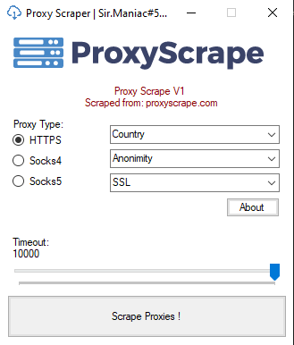

# Proxies-Scraper
Scrape HTTP/S, SOCKS4 and SOCKS5 proxies from proxyscrape.com

Make sure to delete the previous file from the same type of proxies. Otherwise, it will save proxies in the same file.

# Me
Discord: Sir.Maniac#5005

C.to: cracked.to/M4niac
